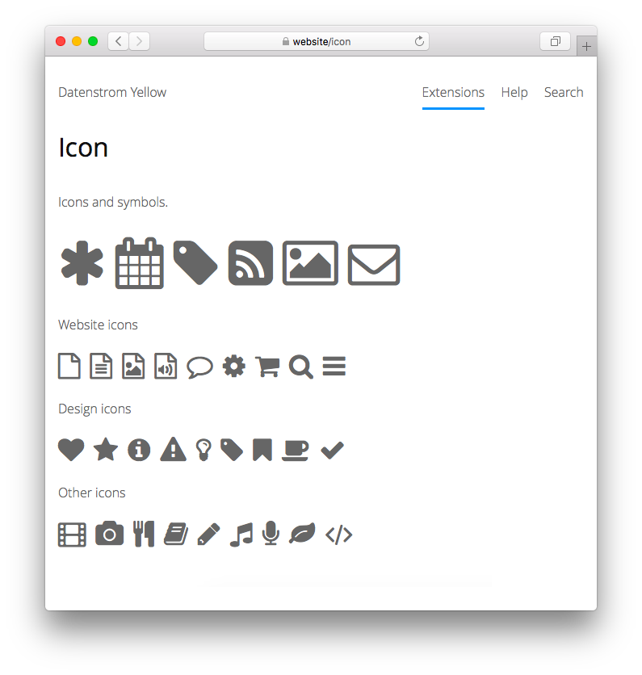

<a href="README-de.md">Deutsch</a> &nbsp; <a href="README.md">English</a> &nbsp; <a href="README-sv.md">Svenska</a>

# Icon 0.9.2

Icons und Symbole.

## Wie man eine Erweiterung installiert

[ZIP-Datei herunterladen](https://github.com/annaesvensson/yellow-icon/archive/refs/heads/main.zip) und in dein `system/extensions`-Verzeichnis kopieren. [Weitere Informationen zu Erweiterungen](https://github.com/annaesvensson/yellow-update/tree/main/README-de.md).

## Wie man ein Icon hinzufügt

Füge `:icon-asterisk:` oder `[icon icon-asterisk]` zum Text einer Seite hinzu. Hier ist eine [komplette Liste mit Icons](https://fontawesome.com/icons).

## Wie man ein Icon zu einer Layoutdatei hinzufügt

Benutze das HTML=Format, zum Beispiel `<i class="icon icon-asterisk" aria-label="Asterisk"></i>`.

## Beispiele

Inhaltsdatei mit Icons und Symbolen:

    ---
    Title: Beispielseite
    ---
    Das ist eine Beispielseite mit Icons und Symbolen.

    :icon-asterisk: :icon-calendar: :icon-tag: 
    :icon-rss-square: :icon-picture-o: :icon-envelope-o:

Icon nach Namen hinzufügen:

    :icon-asterisk:
    :icon-calendar:
    :icon-tag:

Icon mit Abkürzung hinzufügen:

    [icon icon-asterisk]
    [icon icon-calendar]
    [icon icon-tag]

Icon mit HTML hinzufügen:

    <i class="icon icon-asterisk" aria-label="Asterisk"></i>
    <i class="icon icon-calendar" aria-label="Calendar"></i>
    <i class="icon icon-tag" aria-label="Tag"></i>

Websiten-Icons:

    :icon-file-o:         :icon-file-text-o:   :icon-file-image-o:
    :icon-file-audio-o:   :icon-comment-o:     :icon-cog:
    :icon-shopping-cart:  :icon-search:        :icon-bars:

## Einstellungen

Die folgenden Einstellungen können in der Datei `system/extensions/yellow-system.ini` vorgenommen werden:

`IconToolbarButtons` = Symbolleistenschaltflächen für die [Edit-Erweiterung](https://github.com/annaesvensson/yellow-edit/tree/main/README-de.md)  

## Danksagung

Diese Erweiterung enthält [Font Awesome 4.7.0](https://github.com/FortAwesome/Font-Awesome) von Dave Gandy. Danke für die schönen Icons.

## Entwickler

Anna Svensson. [Hilfe finden](https://datenstrom.se/de/yellow/help/).
