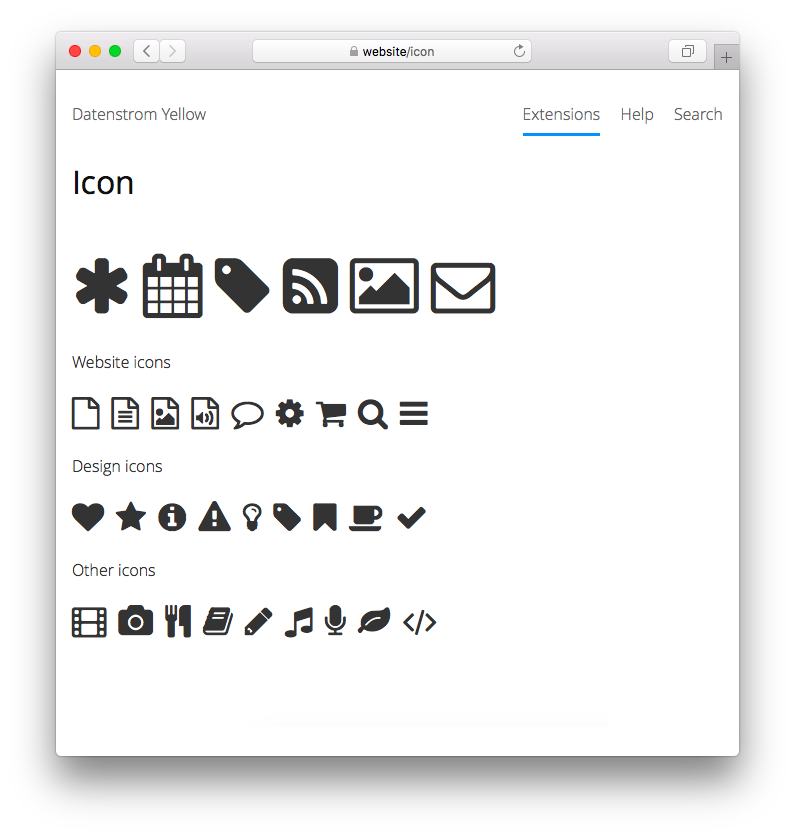

<a href="readme-de.md">Deutsch</a> &nbsp; <a href="readme.md">English</a> &nbsp; <a href="readme-sv.md">Svenska</a>

# Icon 0.9.2

Icons and symbols.

## How to install an extension

[Download ZIP file](https://github.com/annaesvensson/yellow-icon/archive/refs/heads/main.zip) and copy it into your `system/extensions` folder. [Learn more about extensions](https://github.com/annaesvensson/yellow-update).

## How to add an icon

Add `:icon-asterisk:` or `[icon icon-asterisk]` to the text of a page. Here's a [complete list of icons](https://fontawesome.com/icons).

## How to add an icon to a layout file

Use the HTML format, for example `<i class="icon icon-asterisk" aria-label="Asterisk"></i>`.

## Examples

Content file with icons and symbols:

    ---
    Title: Example page
    ---
    This is an example page with icons and symbols.

    :icon-asterisk: :icon-calendar: :icon-tag: 
    :icon-rss-square: :icon-picture-o: :icon-envelope-o:

Adding an icon by name:

    :icon-asterisk:
    :icon-calendar:
    :icon-tag:

Adding an icon with shortcut:

    [icon icon-asterisk]
    [icon icon-calendar]
    [icon icon-tag]
    
Adding an icon with HTML:

    <i class="icon icon-asterisk" aria-label="Asterisk"></i>
    <i class="icon icon-calendar" aria-label="Calendar"></i>
    <i class="icon icon-tag" aria-label="Tag"></i>

Website icons:

    :icon-file-o:         :icon-file-text-o:   :icon-file-image-o:
    :icon-file-audio-o:   :icon-comment-o:     :icon-cog:
    :icon-shopping-cart:  :icon-search:        :icon-bars:

## Settings

The following settings can be configured in file `system/extensions/yellow-system.ini`:

`IconToolbarButtons` = toolbar buttons for the [edit extension](https://github.com/annaesvensson/yellow-edit)  

## Acknowledgements

This extension includes [Font Awesome 4.7.0](https://github.com/FortAwesome/Font-Awesome) by Dave Gandy. Thank you for the beautiful icons.

## Developer

Anna Svensson. [Get help](https://datenstrom.se/yellow/help/).
